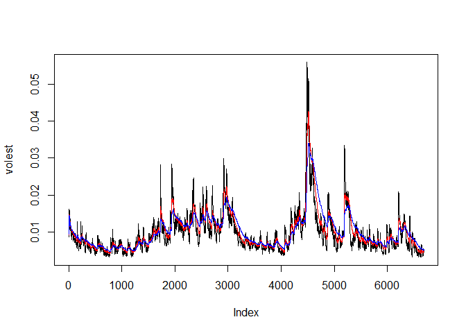

    library(tseries)

    # this is the function in the "tseries" library that goes to the website
    # and download the S&P500 data set:

    SNP500data<-get.hist.quote('^gspc',quote="Close")

    ## 'getSymbols' currently uses auto.assign=TRUE by default, but will
    ## use auto.assign=FALSE in 0.5-0. You will still be able to use
    ## 'loadSymbols' to automatically load data. getOption("getSymbols.env")
    ## and getOption("getSymbols.auto.assign") will still be checked for
    ## alternate defaults.
    ## 
    ## This message is shown once per session and may be disabled by setting 
    ## options("getSymbols.warning4.0"=FALSE). See ?getSymbols for details.

    ## 
    ## WARNING: There have been significant changes to Yahoo Finance data.
    ## Please see the Warning section of '?getSymbols.yahoo' for details.
    ## 
    ## This message is shown once per session and may be disabled by setting
    ## options("getSymbols.yahoo.warning"=FALSE).

    ## time series ends   2017-07-18

    #Below creates the log return of SNP500 data set:

    SNP500return <- log(lag(SNP500data))-log(SNP500data)

    # it calculate the entire volatility for the SNP500 data:

    SNPvolatility <- sd(SNP500return)*sqrt(250)*100

    # it shows that the volatility of SNP500 is 18%
    SNPvolatility

    ## [1] 17.71886

    # below is a function to calculate volatility in a continous lookback window.
    # it is a function of d and log returns.
    # different numbers represent the volatility at particular period of time:
    Volatility <- function(d, logrets) {
      var=0
      lam=0
      varlist <- c()
      for (r in logrets) {
        lam=lam*(1-1/d) + 1
      var=(1-1/lam)*var + (1/lam)*r^2
       varlist <- c(varlist, var)
      }
      sqrt(varlist)}

    # below is the estimate of volatilities correspond to 3 different d:
    volest <- Volatility (10,SNP500return)
    volest2 <- Volatility (40,SNP500return)
    volest3 <- Volatility (90,SNP500return)

    # graphs shows the the estimate of SNP500 volatility over the entire lookback window. 
    # curves of results overlying eachother to show the volatility data with various d. 
    plot(volest, type = "l")
    lines(volest2, type="l" , col="red")
    lines(volest3, type="l" , col="blue")

